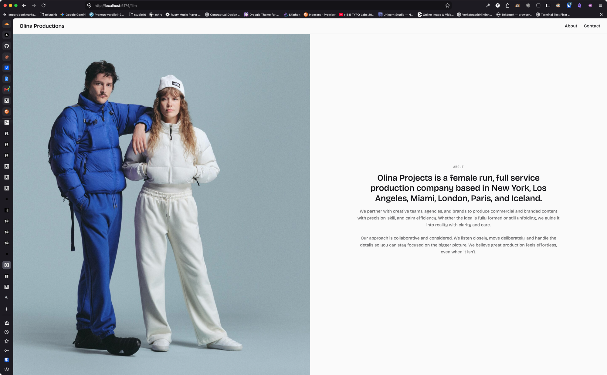

# `SectionSplit fill` hardcodes centred text — the form needs an alignment

**Staged:** 2026-09-03 · from a kol-client-olina session
**Change:** one prop through to `SectionText` in the fill branch (`textAlign`, default `center`)
**Versions read:** `@kolkrabbi/kol-component@0.172.0`

---

## The problem, in one case

`fill` shipped in 0.172.0 (`section-split-fill-variant`, same day) and olina adopted it on the About and Contact sections. The user's ruling on the text block, made on the stopgap before the swap: *"same placement but just aligned to left — if it's 4 columns, the text uses 2, can the text align left and everything else kinda stays as is?"* The block keeps its width and its centre in the half; only the type inside it rags left.

The fill branch (`SectionSplit.jsx:131-142`) passes `align="center"` to `SectionText` as a literal, and `actionsClass` / the meta row carry `justify-center` the same way. `SectionText` itself already takes `align: 'start' | 'center'` (`SectionText.jsx:63`), so the capability exists one level down; the fill form just does not forward it.

## The fix

Forward it: `textAlign = 'center'` on `SectionSplit` (named so it does not collide with `align`, which is the media side), passed as `align={textAlign}` to `SectionText` in the fill branch, and `justify-${textAlign === 'center' ? 'center' : 'start'}` on the actions and meta rows. Default stays `center`, so kolkrabbi.io's use is byte-identical.

Meanwhile olina passes `innerClassName="[&_.kol-section-text]:items-start [&_.kol-section-text]:text-left"` — a descendant override through a supported seam, which works and is the kind of reach-in the prop exists to remove.

## Rejected alternative

`slotClass` — it targets the eyebrow / headline / body slots, not the `kol-section-text` container that carries `items-center text-center`, so it cannot do this.

## Definition of done

- [ ] `SectionSplit fill` renders left-ragged text from one prop, block placement unchanged.
- [ ] Shipped version cited; olina's `innerClassName` override retired against it.

## ✅ RESOLUTION — 2026-09-03 · kol-component@0.173.0

Adopted — `textAlign` on `SectionSplit`, kol-component@0.173.0. Your reading of the split was right: `align` places the block, and there was no way to say anything about the type inside it.

ONE DEVIATION, and it is a widening rather than a narrowing. You scoped the prop to the fill branch; it is forwarded in BOTH forms. A prop named `textAlign` that silently does nothing on the default `SectionSplit` is a documented seam wired to nothing — the exact defect class this repo added a gate for after three of them shipped in one week. Unset, each form keeps precisely what it did: `fill` centres, bounded follows `align` (centred when `align="center"`, else start). So kolkrabbi.io is byte-identical and the bounded form gains an override it did not have, rather than gaining a dead prop.

Verified in a render, and the block placement is the thing I checked hardest because it is what your ruling turns on: `fill` at 1280 puts the text block at 365x160 starting at x138 whether `textAlign` is unset or `start` — identical box, identical position — and only the headline moves, 233 to 138. Bounded is unchanged at 546x160 @ x56, and takes `textAlign="center"` if it ever wants it.

Also as filed: the actions row and the meta strip follow the same value rather than staying pinned to `justify-center`, so a left-ragged block does not leave its buttons centred under it.

Your DoD, less the last box: one prop, placement unchanged, version cited. Retiring the `innerClassName="[&_.kol-section-text]:items-start [&_.kol-section-text]:text-left"` override is yours on the bump — and it should come out rather than be left as a no-op, because a descendant selector into DS internals keeps working right up until the container class changes, and then fails silently.

On the rejected alternative: correct, and worth stating so it is not retried. `slotClass` reaches the eyebrow / headline / body slots, not the `.kol-section-text` container that carries `items-center text-center` — so it never could have done this. That is a real gap in the seam set, not a misuse.

**Remainder here:** none — kol-client-olina bump kol-component@0.173.0, pass textAlign="start" on the About/Contact splits, then delete the innerClassName descendant override.

