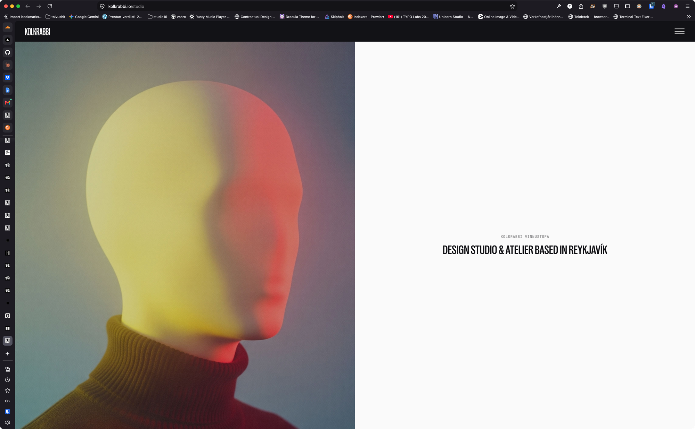
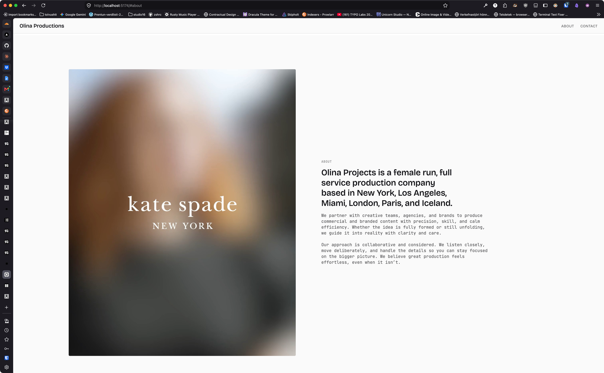

# SectionSplit needs a FILL form — the media fills its half edge to edge, viewport tall

**Staged:** 2026-09-03 · from a kol-client-olina session
**Change:** one prop on `SectionSplit` (`fill`), or a `variant="fill"` — the same anatomy, the frame's bounds released
**Versions read:** `@kolkrabbi/kol-component@0.171.0`, `@kolkrabbi/kol-theme@0.132.1`

---

## The problem, in one case

kol-client-olina wants its About and Contact sections as the 50/50 kolkrabbi.io/studio runs: the viewport in two halves, the image filling one half edge to edge, the text centred in the other. That look is `SectionHero variant="split"`, and the user ruled it out for a section that is not a hero — "don't use hero component there, just notice how it looks".

`SectionSplit` at its tallest (`height="full"`, `ratio="1/1"`, `fullBleed`) renders the second screenshot: a padded, rounded, portrait frame beside the text. By design — `SectionSplitMediaBounded` (2026-08-27) bounds the frame to the rung minus the padding and caps its width at the ratio. That is the right rule for a card with media; it is the wrong rule for a half.

The consumer then hand-authored a `Split.jsx` (`grid min-h-dvh md:grid-cols-2`, image `absolute inset-0 object-cover`, text column `flex items-center justify-center`, stacked below md) — a second copy of a layout the DS already has inside `SectionHero`, in a client repo, with no way to share it.

## The fix

A `fill` form on `SectionSplit` — `fill` boolean or `variant="fill"`:

- the media column drops the bounded frame: no `aspectRatio`, no rung-minus-padding height, no radius, no section padding on that column — `absolute inset-0 object-cover` over the half
- the section is `min-h-dvh` (or the rung, when given) and the text column centres its `SectionText` (`items-center justify-center`, text centred as SectionHero split does)
- `align` keeps choosing the side; below 901px the media stacks on top at `min-h-[50vh]`

Where the split-hero already has this layout, the fill form can reuse it — the difference between the two is the hero's overlay/panel/carousel machinery, not the grid.

## Rejected alternative

`SectionHero variant="split"` — it is the layout, but it carries the hero's contract (overlay, glass panel, foot/overlap, carousel) and its name; the user will not put a hero component under an About section. And the local `Split.jsx`, which olina runs meanwhile: it works and it is the thing this ticket exists to delete.

## Definition of done

- [ ] `SectionSplit` renders a half-filling media column with text centred beside it, from one prop, at ≥901 and stacked below.
- [ ] Shipped version cited; olina's `apps/web/src/components/Split.jsx` retired against it.

## ✅ RESOLUTION — 2026-09-03 · kol-component@0.172.0

Adopted as filed — `fill` on `SectionSplit`, shipped in kol-component@0.172.0.

The diagnosis is the part worth keeping: `SectionSplitMediaBounded` (2026-08-27) is not wrong, it is *scoped* — binding the frame to the rung minus the padding and capping its width at the ratio is exactly right for a card with media, and exactly wrong for a half. So `fill` releases those bounds rather than arguing with them. The media column drops the ratio, the bounded height, the radius and the section padding and covers its half edge to edge; the text column centres its `SectionText`; `align` still picks the side; below 901px the media stacks on top at `min-h-[50vh]`.

Two notes on how it went in.

It is its OWN return, not conditionals threaded through the bounded one. Every bounded rule — the container cap, the section padding, the ratio box, the rung-minus-padding height — is a rule this form does not have, so sharing the JSX would have meant negating each of them at its own site, which is how a variant becomes a maze. The bounded path is byte-identical as a result.

It needed no new CSS. `.kol-section-split-visual` stays on the media half because the theme already gives it `img { width:100%; height:100%; object-fit:cover }` — which is precisely what a filling half wants. The class earned its keep.

Verified in a real render rather than reasoned: at 1200 the media measures 600x750 against a 1200x750 section — exactly half, flush at x=0, computed `aspect-ratio: auto`, radius 0. At a 390x720 viewport it is 390 wide, full-bleed, above the text, and 500 tall (past the 50vh floor). The bounded form at the same size still renders 506x464 inset at x=638 with `4 / 5` and a 4px radius, unchanged.

Your DoD, less the last box: renders from one prop, at 901 and above and stacked below; version cited. Retiring `apps/web/src/components/Split.jsx` is yours on the bump — and it should be deleted, not left dormant, since it is the copy this exists to remove.

On the rejected alternative: agreed, and the reasoning holds beyond this case. `SectionHero variant="split"` is the same grid, but a component's NAME is part of its contract — a hero under an About section is wrong even when the pixels match. Two components sharing a layout is not duplication; two components sharing a name they do not both deserve is.

**Remainder here:** none — kol-client-olina bump kol-component@0.172.0, pass fill on the About/Contact splits, then delete apps/web/src/components/Split.jsx.

