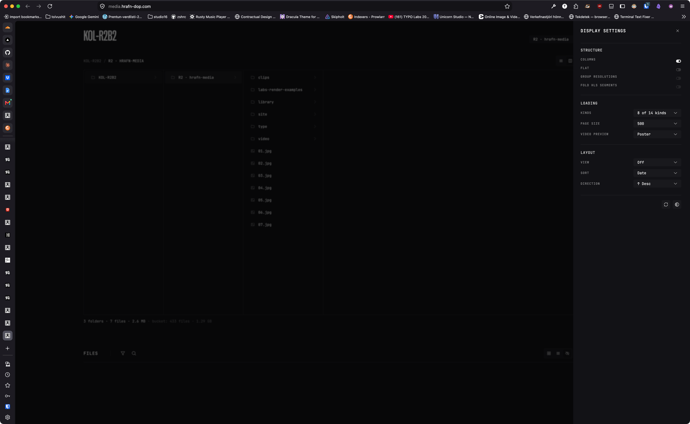
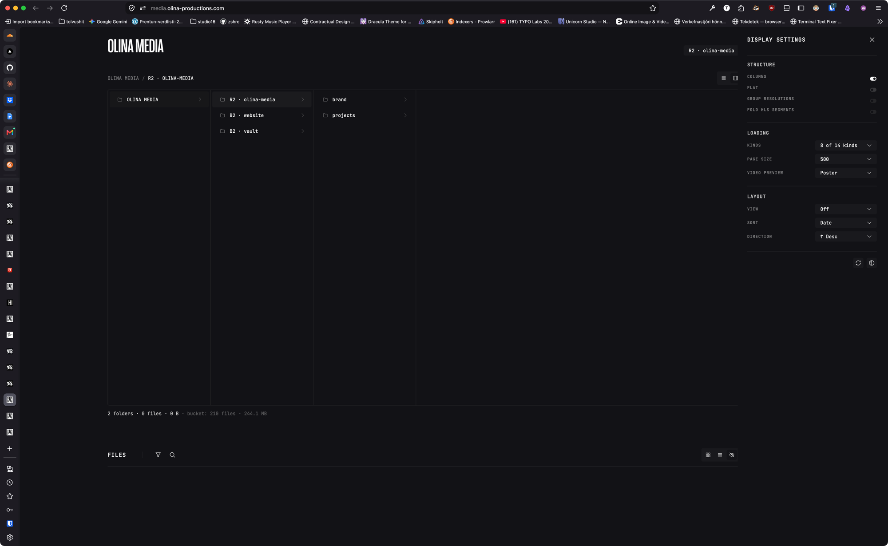

# The settings drawer has no surface of its own — same token as the page, and the scrim is gone

**Staged:** 2026-09-03 · from a kol-client-olina session
**Change:** one class on `ShellDrawer` (or one prop on `SettingsPanel`), plus a ruling on the scrim
**Versions read:** `@kolkrabbi/kol-component@0.167.0`, `@kolkrabbi/kol-theme@0.132.1`

---

## The problem, in one case

`apps/media` (a kol-r2b2 copy) bumped `component 0.119.0 → 0.167.0` / `theme 0.81.0 → 0.132.1` on 2026-09-03. Open the settings drawer on `media.olina-productions.com` and there is **no drawer** — the panel is the same colour as the page, no edge, no dimming, no shadow; the controls float in the right third of the screen. Side by side with kol-client-hrafn's media on the old set, where the same drawer reads as a panel because the page behind it is scrimmed:

The user's first read was "the sidebar background is wrong, it's grey". It is not wrong; it was **always** the page colour. Two things hold it up:

1. `ShellDrawer.jsx:179` paints the panel `bg-surface-primary` — the same token the page body uses (`--kol-surface-primary: #121215` in dark, `kol-base-tokens.css:110`). The drawer has never had a surface of its own; the scrim was what separated it.
2. `SettingsPanel.jsx:104` passes `backdrop={false}` on the user's own 2026-08-30 instruction (*"remove the background overlay and blur when settings sidebar is opened"*, recorded at `SettingsPanel.jsx:19-24`), and `shadow={false}` with it. That ruling took away the only thing making the drawer visible.

So the ruling was right (you tune a surface while looking at it) and the result is wrong (the panel vanished). The fix is the surface, not the scrim.

## The fix

Give the settings drawer its own surface. The theme already carries a darker step: `--kol-surface-tertiary: #0e0e11` (`kol-base-tokens.css:116`) — one step under primary in dark, and the light-side equivalent on the other theme. Either:

- `SettingsPanel.jsx:104` — pass a surface class through the existing `className` seam (`bg-surface-tertiary`), scoped to this panel the same way `backdrop={false}` is; or
- `ShellDrawer.jsx:179` — a `surface` prop (`'primary' | 'tertiary'`) defaulting to primary, so any drawer that drops its backdrop can still read as a panel.

The first is smaller and matches how the no-scrim decision is already scoped. Keep the `border-oq-08` edge that is there.

**The scrim question, asked plainly:** is it meant to stay off the settings drawer? The source says yes and why. If yes, the drawer needs the surface above. If the 08-30 ruling is reconsidered, `backdrop` defaults back to true and nothing else changes — but a scrim over the thing you are tuning is the argument the source already makes against it.

## Rejected alternative

A consumer override in `apps/media/src/index.css` on `.kol-...` drawer selectors. That is the override block kol-r2b2 has already regrown twice (`r2b2-local-ds-overrides-inventory`, 2026-09-02), and the drawer is a DS molecule — every consumer that turns off the backdrop gets the same invisible panel.

## Definition of done

- [ ] The settings drawer on a dark page reads as a panel with `backdrop={false}` — a surface visibly distinct from the page, not only a hairline edge.
- [ ] The token used is a theme surface (`surface-tertiary` or a new named surface), not a literal.
- [ ] Ruling recorded on whether the scrim stays off the settings drawer.
- [ ] Shipped version cited; olina's `apps/media` verified on it at `media.olina-productions.com`.

## Not asked for

The `kol-media-client@0.3.2` bucket-table merge (a consumer passing `buckets: {r2}` now gets Kolkrabbi's `B2 · website` / `B2 · vault` merged in, with no way to exclude them — visible in the second screenshot's column list). Same bump, different package, separate ticket if the user wants it filed.

## ✅ RESOLUTION — 2026-09-03 · kol-component@0.168.0

REJECTED AS SPECIFIED — the surface change is not the fix. The scrim goes back on.

Your diagnosis is exactly right and the DoD's framing is what I am rejecting, not the report. ShellDrawer paints bg-surface-primary, the same token as the page, so the scrim was the only thing separating them; take the scrim away and the panel is invisible. Where we differ is which half to restore. Giving the drawer its own surface would leave the settings drawer as the one drawer in the system with no dimming AND a bespoke surface nothing else uses — two deviations to fix one, and every future drawer that drops its backdrop hits the same wall again.

The scrim is true. SettingsPanel's backdrop={false} is gone and the settings drawer takes the same 48% scrim every other drawer takes. One prop removed, no new token, no new prop, no surface change. The 2026-08-30 'remove the background overlay' instruction is retired by this — it was ruled without the panel-vanishes consequence in view, and the consequence is what you photographed.

Two of your DoD boxes are met by that and two are answered rather than ticked:
- the drawer reads as a panel on a dark page — yes, by the scrim, not by a surface
- the token is a theme surface, not a literal — no token changed at all
- a ruling recorded on whether the scrim stays off — it does not stay off; it is back, and the docstring paragraph that justified turning it off is deleted rather than left to be quoted at the next agent
- verified on media.olina-productions.com — yours to confirm on the bump

Also note the scrim you get is 48%, not the 60% the old source comment mentions: .kol-overlay-scrim was a raw #000 at an off-ladder 60 and .kol-shell-drawer-scrim was already var(--kol-color-ab-black) at 48, so the same gesture dimmed differently depending on the shell. Both are 48% of the token as of kol-theme@0.132.0.

NOT TAKEN UP, as you filed it: the kol-media-client bucket-table merge. File it separately if the user wants it.

**Remainder here:** none — kol-r2b2 bump kol-component@0.168.0 — the drawer scrims again, no consumer change needed.

